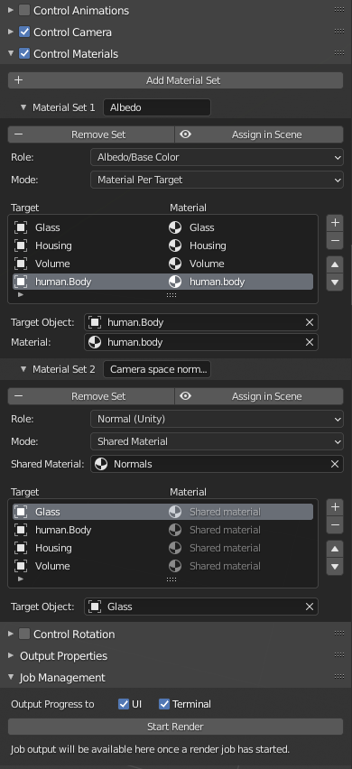

- [Overview](#overview)
- [Features](#features)
	- [Unity integration](#unity-integration)
- [Installation](#installation)
- [Usage](#usage)
	- [Render output](#render-output)
	- [Animation options](#animation-options)
	- [Camera options](#camera-options)
	- [Material options](#material-options)
	- [Rotation options](#rotation-options)
- [Limitations](#limitations)
- [Caveats](#caveats)
- [Feedback](#feedback)
- [FAQs](#faqs)
- [Acknowledgements](#acknowledgements)
- [Screenshots/examples](#screenshotsexamples)

# Overview

**Spritesheet Renderer** is a Blender add-on designed to automate the process of transforming a 3D model into a set of 2D images in the form of a spritesheet, generally for use in a game engine, though not exclusively.

Currently Spritesheet Renderer is only tested on Blender 2.9, though it may work on older versions; see [caveats](#caveats) below.

# Features

* Choose which animations to play out while rendering.
* Choose different materials to iterate through while rendering, allowing you to easily export 2D maps for normals, ambient occlusion, roughness, or any other values you can create a material for.
* Rotate scene objects automatically, letting you capture the object from multiple perspectives with minimal effort.
* Automatically adjust the camera to frame your scene as closely as possible, with multiple adjustment modes to best suit the situation (e.g. framing the target so that the entire animation occurs from one perspective, giving the spritesheet frames the appearance of movement).
* Configure the individual sprite size and how spritesheet files should be split up (e.g. by animation), as well as whether the output files should be padded to a power-of-two size.
* Outputs a JSON file describing the spritesheet, including the individual frame dimensions and animation data, well suited for automatically importing the spritesheet into other programs.
* Contains buttons to preview parts of your configuration in the 3D viewport, making it easy to tell what you're going to get when you render.
* Settings are stored in the .blend file, so you can easily re-render if you've made changes.
* [Terminal](screenshots/terminal_progress_tracking.png) and [GUI](screenshots/ui_progress_tracking.png) output to help track render progress and give you an idea of the time remaining.
* Add-on functionality is exposed via an operator (`spritesheet.render`) and property groups (`bpy.types.Scene.SpritesheetPropertyGroup` and `bpy.types.Scene.ReportingPropertyGroup`) for potential integration via scripting (untested). See [operators.py](operators.py) for other available operators.

## Unity integration

I am personally working on a Unity project, so I have written an asset importer for Unity to handle slicing and animating spritesheets based on the JSON output. It can be found [on my GitHub](https://github.com/chrishayesmu/Unity-Spritesheet-Importer).

# Installation

1. (Prerequisite) Install [ImageMagick](https://imagemagick.org/script/download.php) from the official site. Note the installation path, as you may need to provide it in Blender later (though the add-on will attempt to auto-detect it when enabled).
2. Download the [latest release](https://github.com/chrishayesmu/Blender-Spritesheet-Renderer/releases/latest) of Spritesheet Renderer. You do not need to unzip it.
3. In Blender, navigate to Edit > Preferences > Add-ons and click Install, selecting the ZIP file you just downloaded.
4. Find "Animation: Spritesheet Renderer" in the list and make sure the add-on is enabled.
5. In the add-on preferences, check that the ImageMagick path is populated. If not, provide the absolute path of `magick.exe` in your ImageMagick installation directory.

# Usage

Spritesheet Renderer adds a new UI category in the 3D viewport called "Spritesheet". In there, you will find all of the configuration options, as well as the "Start Render" button and progress of the most recent render job (only visible after starting a render). If you'd prefer to have the addon's UI located in the Render Properties panel, you can configure this in the addon preferences.

Efforts have been made to make this addon intuitive:

* Operators (UI buttons) are stylized and organized similarly to Blender native functionality
* Nearly all operators support undo/redo where it makes sense to do so
* Every piece of the UI has a tooltip on hover, detailing what any given option does
* Most configuration is validated before rendering, and the "Start Render" button will be disabled with an error message if anything is configured wrongly

## Render output

<details>
	<summary>Expand</summary>
By default, if your .blend file has been saved somewhere, the render output will appear in a directory called "Rendered spritesheets" alongside the .blend file. If it has not been saved, the "Rendered spritesheets" directory will be created in the current user's home directory (as defined by Python's `pathlib.Path.home()`).

When rendering, the add-on only changes a few settings - the file format (PNG), color mode (RBGA), baking margin (none), background (transparent), and resolution (user-provided). Everything else is left alone, so you can control those in the usual manner. That includes the choice of render engine, so you can even render in Eevee for rapid prototyping or testing.
</details>

## Animation options

<details>
	<summary>Expand</summary>

When **Control Animations** is enabled, this panel allows you to adjust your animation sets. Each animation set contains a list of scene objects and a corresponding [Action](https://docs.blender.org/manual/en/latest/animation/actions.html) (at this time, [NLA](https://docs.blender.org/manual/en/latest/editors/nla/index.html) is [not supported](#limitations)).

Each object-action pair in a given set will be played at the same time, and stepped through frame-by-frame while rendering; each frame of the action results in a sprite in the spritesheet. Note that frame ranges, as defined in Blender, may not always start at the same point in time. If your actions are meant to be simultaneous within a set, you'll need to ensure the frame ranges line up manually.

> :warning: Each animation set shows the total number of frames it contains, and each object-action pair tells you the precise starting and ending frame. Sometimes this information may be clipped; if this happens, just make the addon panel wider.

Each animation set features a "Play in Viewport" button that can be used to preview how that set will look. Note that the animation set will not touch any objects which aren't listed in the set; if you have other objects in the scene that have actions assigned, they will also begin to animate accordingly. The same is true during rendering.

> :grey_question: The output frame rate option will be applied to your scene while previewing an animation set, to give you the most accurate idea of how the animation looks. During rendering, the frame rate is unused; it is just passed through to the output metadata (JSON) file for other tools to consume.
</details>

## Camera options

<details>
	<summary>Expand</summary>

When **Control Camera** is enabled, you can choose a camera in the scene which Spritesheet Renderer will manipulate. The spritesheet will be rendered from the perspective of this camera, and the camera will be moved and resized (but never rotated) based on the control style you choose:

* **Fit Each Frame**: Before rendering each frame, the camera is adjusted so that it fits the target objects as closely as possible.
* **Fit All Frames**: Before rendering any frame, the camera is adjusted so that it fits the target objects as closely as possible, without ever moving over the course of the render. This is useful with animation; if your character is walking, you may want them to actually move within the animation itself, rather than moving via a physics system. Similarly, if they're swinging a sword, their position of holding the sword neutrally at the start of the animation probably won't fit the sword while it's moving.
* **Fit Each Animation Set**: Similar to Fit All Frames, but the camera is adjusted before each animation set is processed, rather than only once. Note that since the sprite output size is fixed, if your animations don't all fit in the exact same area, objects are likely to appear to be different sizes in different animation sets.
* **Fit Each Rotation**: Similar to Fit Each Animation Set, except the camera is adjusted before rotating objects, rather than before animating. Note that rotation happens before animation, so if you select Fit Each Rotation, it will fit all animation frames for that rotation, rather than a still image (assuming you're using animation).

Every control style depends on you providing a list of objects that are relevant to the camera. This is useful if there are background objects in the scene; if your animation is a character moving on a walkway, you probably don't care that the entire walkway fits in view, as long as the character does.

> :warning: Control Camera only works with orthographic cameras currently; the logic is not in place to pan and zoom perspective or panoramic cameras.

> :grey_question: If Control Camera is not enabled, the spritesheet is rendered from the perspective of [the active camera](https://docs.blender.org/manual/en/latest/editors/3dview/navigate/camera_view.html).
</details>

## Material options

<details>
	<summary>Expand</summary>

When **Control Materials** is enabled, you can set up and configure material sets for your scene. These are simple object-material pairs consisting of an object in the scene and a material to assign to that object. For convenience, you can instead choose a single material to use for every object in the set. The entire spritesheet is rendered once per material set.

There are a number of scenarios where this is useful:

* You want to render the same character, but in different colors. In many games, stronger versions of an early enemy are indicated by a simple color swap.
* You want to render the same character with different effects. For example, maybe your player can turn invisible; by applying an invisibility material, you can easily create the spritesheet for both visible and invisible players, without having to worry you've missed some animations or angles.
* Your engine supports special textures, such as Unity's [normal map and mask textures](https://docs.unity3d.com/Packages/com.unity.render-pipelines.universal@7.0/manual/SecondaryTextures.html). Creating Blender materials can make these much easier to create than if you had to do them by hand.

At the top of each material set is a button labeled "Assign in Scene", that swaps in the materials you've chosen so you can preview them in the viewport. This operation supports undo, so you can take a quick look without worrying that you'll have to change everything back manually afterwards.

> :grey_question: If you select an object without any [material slots](https://docs.blender.org/manual/en/latest/render/materials/assignment.html), one will be created and assigned to automatically while rendering or previewing.

> :warning: If any select objected has more than 1 material slot, rendering will be disabled. Mapping each material to a material slot just becomes too complicated from a UI perspective for this addon. You'll have to split up your mesh so that each mesh can have a single material.

Each material set can have a **role** assigned to it. This is simple metadata describing how that material set is ultimately used, which is passed through to the JSON output file for other tools to consume. It is also used internally for naming individual output files in a consistent way before they are combined into a single spritesheet; for this reason, the role must be unique across material sets (except for the "Other" role as this can feasibly be needed multiple times).
</details>

## Rotation options

<details>
	<summary>Expand</summary>

When **Control Rotation** is enabled, you can select a set of objects that will be rotated several times during rendering. You just specify the number of rotations to use, and the objects are rotated through 0 to 360 degrees accordingly (on the Z axis only).

As an example of when this is useful, imagine a walking animation from left to right. One way to create a right-to-left animation would be to duplicate the action and set the object rotation in the duplicate. However, it would be simpler to just use Control Rotation to adjust the character automatically at render time.

> :warning: Each rotation angle is treated as an absolute value, not an offset to the base rotation. For example, if you choose to rotate your objects 4 times, they will rotate in 90 degree increments, such that the object's Z rotation will be 0, 90, 180, and 270. Even if the object starts at a different rotation, those 4 values are the ones that will be used. (Note that rotation on other axes is not touched.)
>
> The simplest way to work around this is to either [apply rotation](https://docs.blender.org/manual/en/latest/scene_layout/object/editing/apply.html) on your objects, or create a new [Empty](https://docs.blender.org/manual/en/latest/modeling/empties.html) and parent your object to that, then provide the Empty in the Rotation Options panel.

> :warning: If you only want the object rotated for some of your animations, you will likely have to accomplish this by disabling Control Rotation and sending up duplicate actions that have the rotation incorporated.
</details>

# Limitations

* Automated camera control functionality is currently limited to orthographic cameras.
* Animation control works by assigning actions to objects, which are then played frame-by-frame while rendering. At this time there is no support for Blender's Nonlinear Animation (NLA) functionality.
* Each render operation can only be done from the perspective of a single camera; if you need multiple cameras in the same spritesheet, you will have to combine them yourself.
* Rotation is always applied to the object's Z axis; there is currently no way to specify other axes.
* Material set roles are currently limited to my use cases for Unity, but could be [expanded easily](https://github.com/chrishayesmu/Blender-Spritesheet-Renderer/blob/94181b4ce1d1d5563690c25c804af924b1255b4b/property_groups/SpritesheetPropertyGroup.py#L33).
* Right now the file output path is hardcoded (either alongside the .blend file or in the home directory). This would be easy to change if anyone's interested; it just isn't in my use case.
* Sometimes, UI progress tracking updates in a somewhat jerky fashion. This may only be when a debugger is attached.

# Caveats

* I have only tested this add-on on Windows 10, under Blender version 2.90.1 and ImageMagick version 7.0.10-37. I am not familiar with earlier Blender APIs, so I can't say how likely it is to work on previous versions. If you try it, please [let me know](https://github.com/chrishayesmu/Blender-Spritesheet-Renderer/issues/new).
* While I've made an effort to make the add-on's UI easy to understand, I am the only user at the moment, so it may be more complex than I think.
* This is my first substantial Python project, as well as my first Blender add-on, so no doubt it is not idiomatic in many ways.
* I am not 100% confident in the auto-fitting camera functionality, and it may need revision for more complex animations or camera rotations. If that's the case, the renderer can always be used without auto-fitting.

# Feedback

If you do try out Spritesheet Renderer, feel free to [open an issue](https://github.com/chrishayesmu/Blender-Spritesheet-Renderer/issues/new) with any feedback or just to let me know. I'd love to hear from any users. If you're reporting a bug, please include your Blender and ImageMagick versions, as well as your OS.

> :warning: If you are interacting with Spritesheet Renderer programmatically, especially using its operators, please let me know so I'm aware of the need for backwards compatibility in future releases.

# FAQs

<details>
	<summary>How can I know how many sprites will be output for my settings? How many files will they be in?</summary>

### Number of sprites <!-- omit in toc -->

The number of sprites output depends on 3 pieces of data:

* Whether you're using animation sets; if so, **(a)** the total number of frames of animation data across all sets
* Whether you're using material sets; if so, **(b)** how many material sets you have
* Whether you're using rotations; if so, **(c)** how many rotation angles you specify

The final number of sprites is effectively the product of these. Here's an example:

Suppose you set up your scene with 3 animation sets, containing 12, 15, and 20 frames of animation data each. You have 3 material sets (albedo, normal, and mask textures for example). Lastly, you want your objects rendered from 4 different angles. Then variable **(a)** above is `12 + 15 + 30 = 57` frames of data; variable **(b)** is 3, for your 3 material sets; and variable **(c)** is 4, for your 4 rotation angles. The total number of sprites to output is therefore `a * b * c = 57 * 3 * 4 = 684`.

If you're not using any of these features, then the corresponding variable is 1. For example, if you aren't using animation sets or material sets, but you are using 8 rotations, then you will have `1 * 1 * 8 = 8` sprites in the output. At the most extreme, if you have all of the features off, you get only a single sprite in the output - effectively you're just running a normal Blender render process at that point.

### Number of files <!-- omit in toc -->

The number of files depends on the options you've selected in Output Properties. You can choose to separate different animation sets and different rotation angles into their own files; material sets will always be split up.

When separating files by animation set, each animation set will have its own spritesheet file (PNG) and metadata file (JSON). The same is true for separating by rotation angle. When separating by material set (which is always the case), each material set has its own spritesheet, but they all share one JSON file so that the material sets can be easily associated with each other.

Based on this, the number of files depends on:

* **(A)** If separating by animation set, the number of animation sets; else treat this as 1
* **(B)** If separating by rotation angle, the number of angles; else treat this as 1
* **(C)** The number of material sets

There will be `A * B * C` spritesheet files, and `A * B` JSON files.

</details>

<details>
	<summary>Why can't I have multiple material sets output to the same image file?</summary>

There's no fundamental reason, but at this time it's simply not supported (specifically, the addon would need to output additional frame data to denote the beginning and ending of each material set in the spritesheet). Since my personal use case is Unity, and the materials need to be separate files in Unity anyway, this was just never a priority.
</details>

<details>
	<summary>Can an animation set contain actions of different lengths?</summary>

Yes, but the current animation frame is set for the entire scene, not for each individual action. That means that if your actions have different frame ranges, their corresponding objects will spend some number of frames being unanimated. The standard Blender behavior for this appears to be that if the scene's frame is **before** the action's start frame (e.g. the scene is on frame 2 but your action begins at frame 5), the object will be at the action's starting frame. Conversely, if the scene's frame is **after** the action's end frame, the object will be at the action's ending frame.

If this is unclear, set up some simple animations with different frame ranges, then use Spritesheet Renderer's "Play in Viewport" functionality (located in any animation set) to see how they play together.
</details>

<details>
	<summary>Can I add a border or empty space between sprites?</summary>

At this time that is not supported, but it wouldn't be difficult to add. If this is important to you, please [open an issue](https://github.com/chrishayesmu/Blender-Spritesheet-Renderer/issues/new) describing your use case.
</details>

<details>
	<summary>What is the output format for the spritesheet?</summary>

If you are parsing the spritesheet yourself, it may help to know that the spritesheet is **row-major**, and the first frame of the render is in the top left corner of the final image. Frames then proceed from left-to-right until the end of the column, then the output moves down one row and continues from the left edge again. For example, here is the frame order with 16 total frames arranged in 4 rows and 4 columns:

|           | Col 0 | Col 1 | Col 2 | Col 3 |
| --------- | ----- | ----- | ----- | ----- |
| **Row 0** | 0     | 1     | 2     | 3     |
| **Row 1** | 4     | 5     | 6     | 7     |
| **Row 2** | 8     | 9     | 10    | 11    |
| **Row 3** | 12    | 13    | 14    | 15    |

The JSON output includes the number of rows and columns, and all frame numbers in the JSON follow this scheme. Any frame's row and column number are easily calculated as `row = floor(frameNum / numCols)` and `col = frameNum % numCols`.
</details>

<details>
	<summary>What is the output file format for the JSON metadata?</summary>

The output format will differ slightly based on whether animations and/or materials are in use. The simplest thing to do is experiment a little and see the output that way. In this sample, animations and rotations are in use, but materials are not.

```json
{
	"baseObjectName": "wheeled_enemy",
	"spriteWidth": 80,
	"spriteHeight": 80,
	"numColumns": 12,
	"numRows": 12,
	"imageFile": "wheeled_enemy.png",
	"animations": [
		{
			"frameRate": 24,
			"name": "Fire cannons together",
			"numFrames": 18,
			"rotation": 0,
			"startFrame": 0
		},
		{
			"frameRate": 24,
			"name": "Fire cannons together",
			"numFrames": 18,
			"rotation": 45,
			"startFrame": 18
		},
		... omitted for brevity ...
		{
			"frameRate": 24,
			"name": "Fire cannons together",
			"numFrames": 18,
			"rotation": 315,
			"startFrame": 126
		}
	]
}
```

</details>

# Acknowledgements

Inspiration for this project, as well as a good chunk of the initial code, is owed to [theloneplant/blender-spritesheets](https://github.com/theloneplant/blender-spritesheets/).

# Screenshots/examples

All screenshots can be found in [the screenshots folder](screenshots/).

## Addon UI (except Control Materials) <!-- omit in toc -->

<details>
	<summary>Expand</summary>


</details>

## Control Materials UI <!-- omit in toc -->

<details>
	<summary>Expand</summary>



</details>

## Example spritesheet output <!-- omit in toc -->

<details>
	<summary>Expand</summary>

This spritesheet was generated with the 'Control Animations' and 'Control Rotation' options enabled. There are 8 rotations and 1 animation in the spritesheet. There is some empty space between sprites because the camera control was configured with "Fit All Frames"; due to the empty space, when this spritesheet is animated, the object will move without being clipped.


</details>