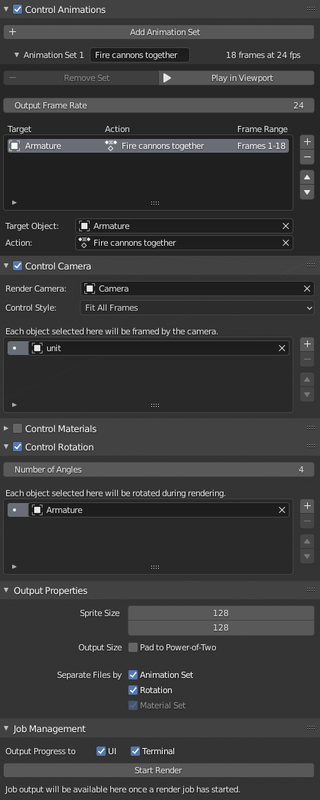

# Overview

**Spritesheet Renderer** is a Blender add-on designed to automate the process of transforming a 3D model into a set of 2D images in the form of a spritesheet, generally for use in a game engine, though not exclusively.

Currently Spritesheet Renderer is only tested on Blender 2.9, though it may work on older versions; see [caveats](#caveats) below.

# Features

* Choose which animations to play out while rendering.
* Rotate the render target through a number of user-specified angles, letting you capture the object from multiple perspectives with minimal effort. (You can optionally choose a second object to apply the rotation to, useful with armatures.)
* Choose different materials to iterate through while rendering, allowing you to easily export 2D maps for normals, ambient occlusion, roughness, or any other values you can create a material for.
* Automatically adjust the render camera to frame the render target as closely as possible, with multiple adjustment modes to best suit the situation (e.g. framing the target so that the entire animation occurs from one perspective, giving the spritesheet frames the appearance of movement).
* Configure the individual sprite size and how spritesheet files should be split up (e.g. by animation), as well as whether the output files should be padded to a power-of-two size.
* Press `ESC` to cancel a render job at any time (may take a few seconds to take effect).
* Outputs a JSON file describing the spritesheet, including the individual frame dimensions and animation data, well suited for automatically importing the spritesheet into other programs.
* Settings are stored in the .blend file, so you can easily come back and re-render if you've made changes.
* [Terminal](screenshots/terminal_progress_tracking.png) and [GUI](screenshots/ui_progress_tracking.png) output to help track render progress and give you an idea of the time remaining.
* Add-on functionality is exposed via an operator (`spritesheet.render`) and property groups (`bpy.types.Scene.SpritesheetPropertyGroup` and `bpy.types.Scene.ReportingPropertyGroup`) for potential integration via scripting (untested).

## Unity integration

I am personally working on a Unity project, so I am writing an asset importer for Unity to handle slicing and animating spritesheets based on the JSON output. I will provide a link to that when ready.

# Installation

1. (Prerequisite) Install [ImageMagick](https://imagemagick.org/script/download.php) from the official site. Note the installation path, as you may need to provide it in Blender later (though the add-on will attempt to auto-detect it when enabled).
2. Download the [latest release](https://github.com/chrishayesmu/Blender-Spritesheet-Renderer/releases/latest) of Spritesheet Renderer. You do not need to unzip it.
3. In Blender, navigate to Edit > Preferences > Add-ons and click Install, selecting the ZIP file you just downloaded.
4. Find "Animation: Spritesheet Renderer" in the list and make sure the add-on is enabled.
5. In the add-on preferences, check that the ImageMagick path is populated. If not, provide the absolute path of `magick.exe` in your ImageMagick installation directory.

# Usage

Spritesheet Renderer adds a new UI category in the 3D viewport called "Spritesheet". In there, you will find all of the configuration options, as well as the "Start Render" button and progress of the most recent render job (only visible after starting a render).

Not all options will be documented here, but every piece of the UI has a tooltip on hover, so check those out for usage info. If your configuration is invalid for any reason, the "Start Render" button will be disabled with a message. (Due to how Blender's UI updates work, you may have to move your mouse over the panel to make the message appear.)

By default, if your .blend file has been saved somewhere, the render output will appear in a directory called "Rendered spritesheets" alongside the .blend file. If it has not been saved, the "Rendered spritesheets" directory will be created in the current user's home directory (as defined by Python's `pathlib.Path.home()`).

When rendering, the add-on only changes a few settings - the file format (PNG), color mode (RBGA), baking margin (none), background (transparent), and resolution (user-provided). Everything else is left alone, so you can control those in the usual manner. That includes the choice of render engine.

Hopefully the add-on is straightforward to use. Check out the [screenshots section](#screenshotssamples) for some examples.

## Spritesheet order

If you are parsing the spritesheet yourself, it may help to know that the first frame of the render is in the top left corner of the final image. Frames then proceed from left-to-right until the end of the column, then the output moves down one row and continues from the left edge again. For example, here is the frame order with 16 total frames arranged in 4 rows and 4 columns:

|           | Col 0 | Col 1 | Col 2 | Col 3 |
| --------- | ----- | ----- | ----- | ----- |
| **Row 0** | 0     | 1     | 2     | 3     |
| **Row 1** | 4     | 5     | 6     | 7     |
| **Row 2** | 8     | 9     | 10    | 11    |
| **Row 3** | 12    | 13    | 14    | 15    |

The JSON output includes the number of rows and columns, and all frame numbers in the JSON follow this scheme. Any frame's row and column number are easily calculated as `row = floor(frameNum / numCols)` and `col = frameNum % numCols`.

# Limitations

* Automated camera control functionality is currently limited to orthographic cameras.
* Only one object may be active for rendering at a time, and all material changes will be applied to that object. (Other objects can be enabled for rendering, but they won't be manipulated by the add-on at all.)
* Each render operation can only be done from the perspective of a single camera; if you need multiple cameras in the same spritesheet, you will have to combine them yourself.
* Rotation is always applied to the object's Z axis, which assumes that the camera is coming from above.
* When rendering multiple materials, you can select each material's role (e.g. base color, normal map, etc), which will be output in the JSON for other tools to use. These roles are currently limited to my use cases for Unity, but could be [expanded easily](https://github.com/chrishayesmu/Blender-Spritesheet-Renderer/blob/94181b4ce1d1d5563690c25c804af924b1255b4b/property_groups/SpritesheetPropertyGroup.py#L33).
* Right now the file output path is hardcoded (either alongside the .blend file or in the home directory). This would be easy to change if anyone's interested; it just isn't in my use case.
* Newly created materials or actions may take up to 10 seconds to appear in the add-on UI, and you may have to mouse over the add-on UI before it updates to show them.
* Sometimes, UI progress tracking updates in a somewhat jerky fashion. This may only be when a debugger is attached.

# Caveats

* I have only tested this add-on on Windows 10, under Blender version 2.90.1 and ImageMagick version 7.0.10-37. I am not familiar with earlier Blender APIs, so I can't say how likely it is to work on previous versions. If you try it, please [let me know](https://github.com/chrishayesmu/Blender-Spritesheet-Renderer/issues/new).
* While I've made an effort to make the add-on's UI easy to understand, I am the only user at the moment, so it may be more complex than I think.
* This is my first substantial Python project, as well as my first Blender add-on, so no doubt it is not idiomatic in many ways.
* I am not 100% confident in the auto-fitting camera functionality, and it may need revision for more complex animations or camera rotations. If that's the case, the renderer can always be used without auto-fitting.

# Feedback

If you do try out Spritesheet Renderer, feel free to [open an issue](https://github.com/chrishayesmu/Blender-Spritesheet-Renderer/issues/new) with any feedback or just to let me know. I'd love to hear from any users.

# Acknowledgements

Inspiration for this project, as well as a good chunk of the initial code, is owed to [theloneplant/blender-spritesheets](https://github.com/theloneplant/blender-spritesheets/).

# Screenshots/samples

All screenshots can be found in [the screenshots folder](screenshots/).

## Valid configuration



## Invalid configuration: no animations in file


## Example spritesheet output

This spritesheet was generated with the 'Animate During Render' and 'Rotate Object' options enabled. There are 8 rotations and 1 animation in the spritesheet. There is some empty space between sprites because the camera control was configured with "Fit All Frames"; due to the empty space, when this spritesheet is animated, the object will move without being clipped.


## Sample JSON

The output format will differ slightly based on whether animations and/or materials are in use. The simplest thing to do is experiment a little and see the output that way. In this sample, animations and rotations are in use, but materials are not. This corresponds to the example output directly above.

```
{
	"baseObjectName": "wheeled_enemy",
	"spriteWidth": 80,
	"spriteHeight": 80,
	"numColumns": 12,
	"numRows": 12,
	"imageFile": "wheeled_enemy.png",
	"animations": [
		{
			"frameRate": 24,
			"name": "Fire cannons together",
			"numFrames": 18,
			"rotation": 0,
			"startFrame": 0
		},
		{
			"frameRate": 24,
			"name": "Fire cannons together",
			"numFrames": 18,
			"rotation": 45,
			"startFrame": 18
		},
		... omitted for brevity ...
		{
			"frameRate": 24,
			"name": "Fire cannons together",
			"numFrames": 18,
			"rotation": 315,
			"startFrame": 126
		}
	]
}
```